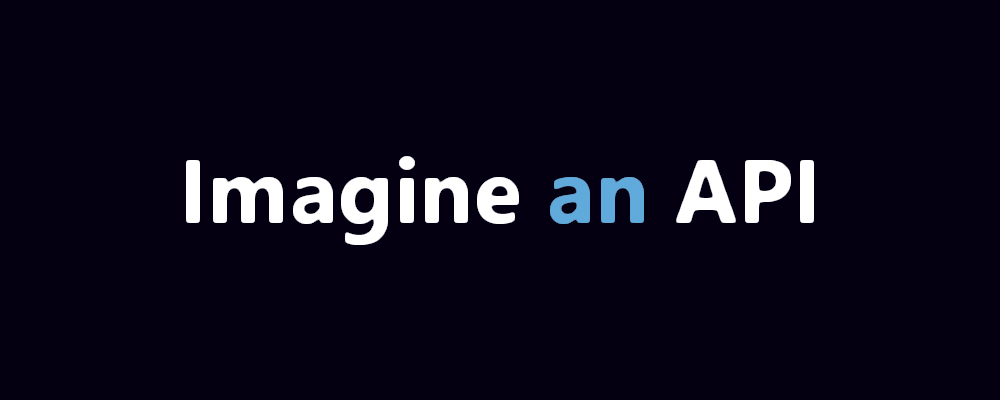

**easy-api.ts** is a tiny but powerful library to create simple
APIs easily, written in TypeScript and taking the boundaries of
string-based interpreted languages, allows you to take all your
ideas from mind to reality.

## Features

-   📝 Easy to learn.
-   📚 Constant updates.
-   🔥 Image manipulation.
-   🚀 Optimized and advanced codes and functions.

## Requirements

-   Basic understanding of [JavaScript](https://developer.mozilla.org/en-US/docs/Learn/JavaScript).
-   [Node.JS](https://nodejs.org/) installed on your machine.

## Basic Setup

```js
// ./index.js
var { API } = require("easy-api.ts");
// ^ requiring the main hub of the API.

var api = new API({
    dots: false, // Selects the available syntax styles, check "syntax" guide for further information.
    reverse: false, // Whether enable/disable reverse reading.
});

// Adding a simple "hello" route.
api.route({
    url: "/hello",
    method: "get",
    code: `
        $reply[
            $setCode[200]
            $setType[json]
            $setBody[{
                "hello": "world"
            }]
        ]
    `,
});

// Let the API connect using the given host address and port.
api.connect({
    host: String,
    port: Number,
});
```

:::note
**easy-api.ts** is a wrapper of [Fastify](https://fastify.dev).
:::
